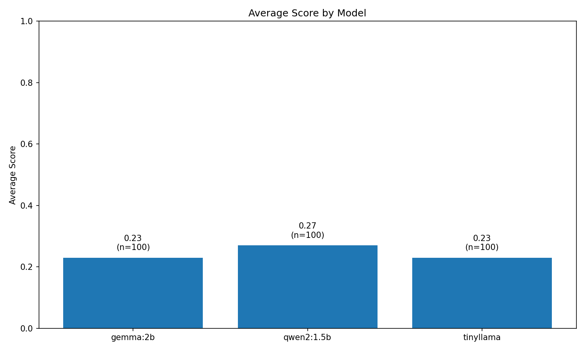
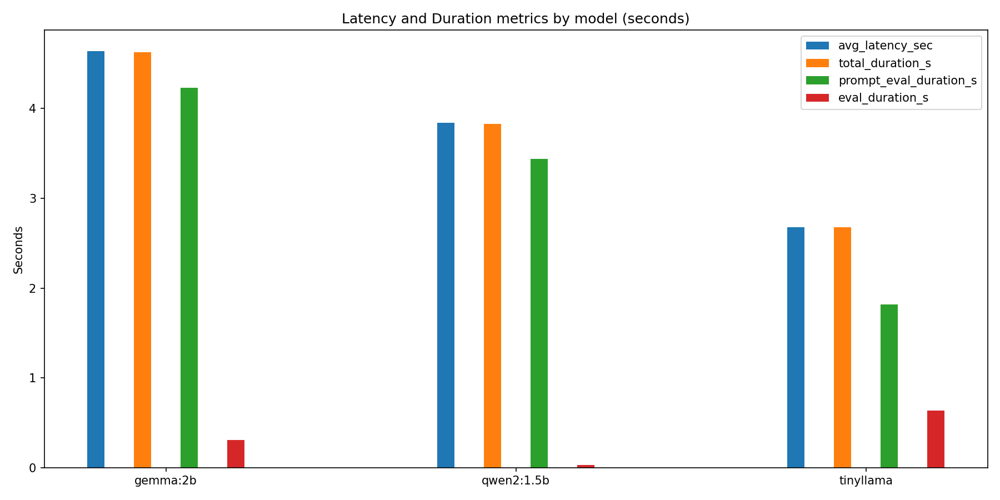
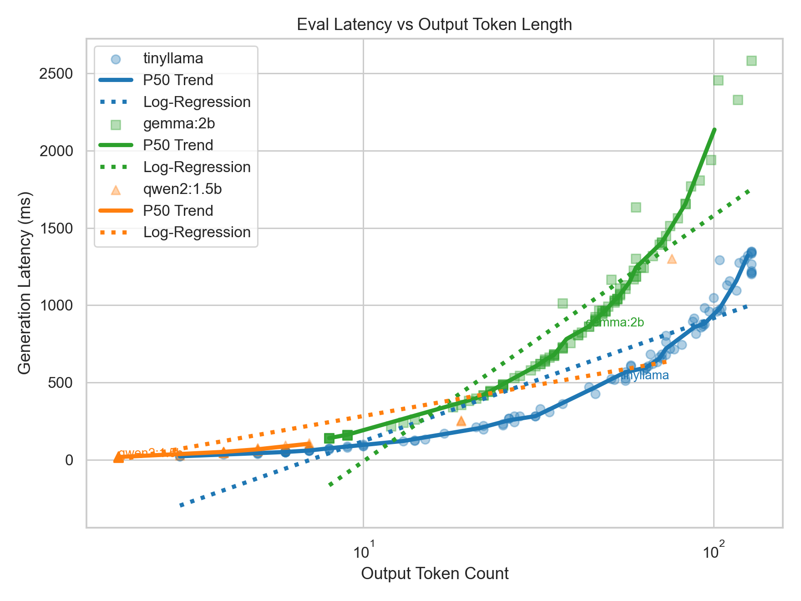

# benchmark_small_llms

Benchmarks for small LLMs focusing on latency and quality evaluation. This repository provides simple scripts to measure latency, token usage, and evaluation duration across models and prompts, plus plotting helpers to visualize results.

## What this project does

- Runs benchmark prompts (MMLU from Hugging Face) against multiple models: [MMLU abstract_algebra (test)](https://huggingface.co/datasets/cais/mmlu/viewer/abstract_algebra/test)
- Measures latency, prompt/output token counts, and evaluation duration.
- Saves raw results to `results_local.csv` and generates plots.
- Provides small test and example scripts for quick validation.

## Repo structure

- `benchmark.py` - main benchmarking script (runs prompts and records metrics).
    - generates `results_local.csv` (example output from a previous run).
- `chart.py` - plots average score and duration for all models
    - generates `model_summary.csv` and `avg_by_model_<>.png` plots
- `plot_all_latency_chart.py`,  `latency_heatmap.py`  - plotting utilities used to create visualizations.
    - `all_scatter_latency_plots/`, `heatmaps/` - folder containing generated PNG charts (token counts vs latency/duration, etc.).
- `requirements.txt` - Python dependencies for running the project.
- `benchmark_test.py` - an example / test harness for the benchmark judgement logic.
- `test.py` - small quick-run script or smoke test.

## Quickstart

Requirements:
- Python 3.10+ recommended (the project was developed with modern Python).
- A working Python environment and pip.

1) Install dependencies

```bash
python3 -m venv .venv
source .venv/bin/activate
pip install -r requirements.txt
```
2) Running Ollama locally (recommended for local benchmarks)

This project uses a local Ollama server by default (the benchmark scripts call `http://127.0.0.1:11434/api/generate`). If you want to run models locally, here are quick steps for macOS (adjust for other OSes):

    1. Install Ollama (macOS/Homebrew):

    ```bash
    brew install ollama
    ```

    2. Pull models you want to benchmark (examples):

    ```bash
    ollama pull gemma:2b
    ollama pull qwen2:1.5b
    ollama pull tinyllama
    ```

    Make sure the model tags you pull match `MODELS` in `benchmark.py` (e.g. `gemma:2b`).

    3. Start the Ollama server:

    ```bash
    ollama serve
    ```

    By default the server listens on `127.0.0.1:11434` and the benchmark scripts use the `/api/generate` endpoint. If you run Ollama on a different host/port, update the `url` in `benchmark.py` accordingly.

    4. Optional: list pulled models

    ```bash
    ollama list
    ```

Notes:
- Ollama responses often include metadata fields (e.g. `total_duration`, `prompt_eval_duration`, `eval_duration`) that the plotting scripts attempt to parse; ensure your Ollama version returns those fields if you rely on duration-based plots.
- If you prefer remote APIs (OpenAI, Anthropic, etc.), adapt `benchmark.py` to call those endpoints and return compatible metadata for plotting.


3) Run a benchmark

The repository includes `benchmark.py`. Depending on how your models are configured, run it like:

```bash
# run the main benchmark (may require env vars or local model endpoints)
python benchmark.py

# run the example/test harness
python benchmark_test.py

# run a quick smoke test
python test.py
# benchmark_small_llms

Benchmarks for small LLMs focusing on latency, token usage, and quality evaluation. This repo provides scripts to run simple benchmarks, capture timing/metadata, and generate diagnostic plots (including a heatmap for density/cost insight).

## What this project does

- Runs benchmark prompts (from Hugging Face datasets) against models configured in `benchmark.py`.
- Measures latency, prompt/output token counts, evaluation durations and optional metadata returned by local model endpoints.
- Saves raw results to `results_local.csv` and generates plots in `plots/` (or a custom output dir).
- Includes plotting utilities and example plotting scripts to visualize per-model performance, latency vs tokens, and heatmaps for expensive regions.

## Repo structure (key files)

- `benchmark.py` - main benchmarking script (runs prompts and records metrics to `results_local.csv`).
- `benchmark_test.py` / `test.py` - small smoke tests / harnesses.
- `chart.py` - summary charts & model-level aggregates (now writes `model_summary.csv`).
- `plot_all_latency_charts.py` - diagnostic scatter plots (per-model colors, markers, and annotations)that saves multiple plot filenames for compatibility.
- `latency_heatmap.py` - NEW: generates 2D heatmaps (prompt tokens x output tokens) colored by latency, eval duration, or cost (default: latency)
    --usage python latency_heatmap.py --metric 
- `results_local.csv` - example or output CSV with columns like `model,prompt_id,output,score,latency_sec,metadata`.
- `all_scatter_latency_plots/` -  output directory for generated scatter plots (PNG format).
- `heatmaps/` - output directory for generated heatmap plots (PNG format).
- `requirements.txt` - Python dependencies.

## Quickstart

Requirements:
- Python 3.10+ recommended.
- A virtualenv and pip.

Install deps and activate venv:

```bash
python3 -m venv .venv
source .venv/bin/activate
pip install -r requirements.txt
```

Run the benchmark (adjust `MODELS` in `benchmark.py` or environment variables as needed):

```bash
python3 benchmark.py
```

Run tests or example harnesses:

```bash
python3 benchmark_test.py
python3 test.py
```

## Plotting and visualizations

After running a benchmark, use the included plotting scripts to create visualizations. Examples:

- Summary chart (average score by model + durations):
	```bash
	python3 chart.py
	# -> writes model_summary.csv, avg_by_model_score.png, avg_by_model_durations.png
	```
    - Output files produced by chart.py:
        - `avg_by_model_score.png` — summary chart of average score per model.

        

        - `avg_by_model_durations.png` — summary chart of average evaluation duration per model.

        

- Diagnostic latency scatter plots (per-model markers, annotations):
	```bash
	python3 plot_all_latency_charts.py
	# -> writes several plots under all_scatter_latency_plots/ 
	```
    - `all_scatter_latency_plots/2_eval_latency_vs_output_tokens.png` — Diagnostic scatter plot (eval latency vs output token count)

    

- Latency / Cost heatmap (best for density & cost insight):
	```bash
	# latency heatmap (prompt tokens X, output tokens Y, color=latency)
	python3 latency_heatmap.py --metric latency

	# cost heatmap (requires --cost-per-token)
	python3 latency_heatmap.py --metric cost --cost-per-token 0.000002

    # eval_duration heatmap
    python3 latency_heatmap.py --metric eval_duration

    # ->writes plots under heatmaps/
	```

Why the heatmap is useful
- Shows “expensive regions” where certain prompt/output token combinations produce high latency or cost.
- Helps define routing rules (send small prompts to fast models, larger prompts to higher-capacity models).

## Output filenames to expect

- `results_local.csv` — raw per-call results from `benchmark.py`.
- `model_summary.csv` — per-model aggregated metrics produced by `chart.py`.
- `avg_score_by_model.png`, `avg_score_by_model_durations.png` — summary visuals.
- `prompt_tokens_vs_prompt_duration.png`, `output_tokens_vs_eval_duration.png`, `prompt_tokens_vs_latency.png`, `output_tokens_vs_latency.png`, `total_tokens_vs_latency.png` — diagnostic scatter plots.
- `latency_heatmap.png` (or `eval_duration_heatmap.png` / `cost_heatmap.png` depending on metric) — binned 2D heatmap.


## Tips & troubleshooting

- If plots appear as a single color, ensure your CSV `model` column has distinct labels; the plotting scripts map colors by categorical model names.
- If durations in metadata look huge (e.g., in the billions), scripts include heuristics to convert nanoseconds -> seconds; confirm the metadata units your model endpoint returns.
- For crowded scatterplots consider switching to heatmaps (density) or annotating only medians to reduce clutter.

## Extending the benchmark

- Add the dataset in `benchmark.py`, of different subsets like `all`, `high_school_chemistry`, `college_mathematics`.
- Add model-specific pricing to produce more accurate cost heatmaps, or extend `latency_heatmap.py` to accept a pricing table per model.

## Contributing

PRs welcome. For larger changes, open an issue describing what you'd like to add.

## License

See `LICENSE` for license terms.

Happy benchmarking!
